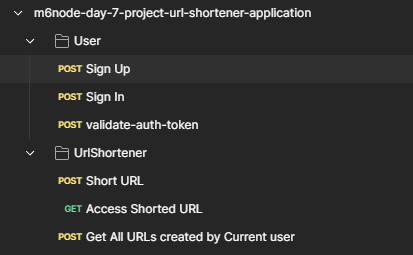

# URL Shortener Application (Day 7 Project, Module #6, MERN Stack)


## Overview:
+ In this assignment, i have developed a URL shortener application that takes long URLs as input and generates shorter, more manageable links.
+ The goal is to create a service that efficiently converts lengthy URLs into concise ones, making sharing and accessing links easier for users.
+ My implementation should include key features such as generating unique short codes, redirecting users to the original URL, and tracking usage analytics. 
+ Through this assignment, i have learnt development, database management, and algorithmic considerations to build a robust and user-friendly URL shortening service.

## Key features:
+ MVC Framework was used to built the application
+ MongoDB as backend Database 
+ ExpressJS for Server Implementation
+ NodeJS for BackEnd
+ ReactJS for FrontEnd

## .env file
```javascript
PORT=4000
PRIVATE_KEY= Create your own private key any random plain text will work
MONGODB_CONNECTION_STRING= get it from Yours MongoDB Atlas account (https://cloud.mongodb.com/)
```

## How to install and run in yours local machine
```bash
npm install
npm run start
```

## Tech. Stack Used:
+ [MongoDB](https://www.mongodb.com/) 
+ [ExpressJS](https://expressjs.com/) 
+ [ReactJS](https://react.dev/) 
+ [NodeJS](https://nodejs.org/en/) 

## Author
[Abhishek kumar](https://www.linkedin.com/in/alex21c/), ([Geekster](https://geekster.in/) MERN Stack FS-14 Batch)


